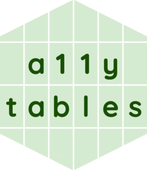

<!-- README.md is generated from README.Rmd. Please edit that file -->

```{r setup, include = FALSE}
knitr::opts_chunk$set(
  collapse = TRUE,
  comment = "#",
  fig.path = "man/figures/README-",
  out.width = "100%"
)
```

# {a11ytables} <a href="https://co-analysis.github.io/a11ytables/"></a>

<!-- badges: start -->
[](https://www.repostatus.org/#active)
[](https://CRAN.R-project.org/package=a11ytables)
[](https://github.com/co-analysis/a11ytables/actions)
[](https://codecov.io/gh/co-analysis/a11ytables?branch=main)
<!-- badges: end -->

## Purpose

An R package to help automatically create reproducible spreadsheets that adhere to the latest guidance  on [releasing statistics in spreadsheets](https://analysisfunction.civilservice.gov.uk/policy-store/releasing-statistics-in-spreadsheets/) from the UK government's [Analysis Function Central Team](https://analysisfunction.civilservice.gov.uk/), with a focus on accessibility ('a11y').

Visit [the {a11ytables} website](https://co-analysis.github.io/a11ytables/) for documentation.

## Accessibility

This package is not intended for creating perfectly accessible spreadsheets but will help with the bulk of the work needed. Users of this packages should refer back to [the main spreadsheet guidance](https://analysisfunction.civilservice.gov.uk/policy-store/releasing-statistics-in-spreadsheets/) or [the spreadsheet accessibility checklist](https://analysisfunction.civilservice.gov.uk/policy-store/making-spreadsheets-accessible-a-brief-checklist-of-the-basics/) after using it to make sure nothing has been missed. Please email [analysis.function@ons.gov.uk](mailto:analysis.function@ons.gov.uk) if you use the package so they can monitor use and the outputs produced.

## Contribute

The package is under (opinionated) active development. Please see [the NEWS file](https://co-analysis.github.io/a11ytables/news/index.html) for the latest changes. 

To contribute, please add [an issue](https://github.com/co-analysis/a11ytables/issues) or [a pull request](https://github.com/co-analysis/a11ytables/pulls) after reading [the code of conduct](https://github.com/co-analysis/a11ytables/blob/main/CODE_OF_CONDUCT.md) and [contributing](https://github.com/co-analysis/a11ytables/blob/main/.github/CONTRIBUTING.md) guidance. 

## Install

Install the package [from GitHub](https://github.com/co-analysis/a11ytables) using [{remotes}](https://remotes.r-lib.org/).

```{r install, eval=FALSE}
install.packages("remotes")  # if not already installed
remotes::install_github("co-analysis/a11ytables", build_vignettes = TRUE)
library(a11ytables)  # attach package
```

The package depends on [{openxlsx}](https://ycphs.github.io/openxlsx/) and [{pillar}](https://pillar.r-lib.org/), which are also installed with {a11ytables}.

## Use

To create a spreadsheet:

1. Use `create_a11ytable()`
1. Pass the output to `generate_workbook()`
1. Pass the output to `openxlsx::saveWorkbook()`

Run `?function_name` or visit [the package website](https://co-analysis.github.io/a11ytables/reference/index.html) for function documentation. For long-form documentation, run `browseVignettes("a11ytables")` or [visit the package website](https://co-analysis.github.io/a11ytables/) to read the:

* [introductory vignette](https://co-analysis.github.io/a11ytables/articles/a11ytables.html) to get started
* [accessbility checklist vignette](https://co-analysis.github.io/a11ytables/articles/checklist.html) to see how the package complies with best-practice guidance
* [terminology vignette](https://co-analysis.github.io/a11ytables/articles/terminology) to understand the nomenclature of spreadsheet terms as used in this package
* [package structure vignette](https://co-analysis.github.io/a11ytables/articles/structure) to see how the package works under the hood

This package also includes [an RStudio Addin](https://rstudio.github.io/rstudioaddins/) that inserts pre-filled demo skeletons of the {a11ytables} workflow.

## Related projects

The Analysis Function Central Team released [a Python package called 'gptables'](https://github.com/best-practice-and-impact/gptables) that has [been updated given the latest best-practice guidance](https://dataingovernment.blog.gov.uk/2022/06/24/automatically-produce-best-practice-spreadsheets/). {a11ytables} is an independent effort that offers a native R solution that is very similar to gptables in its outputs, though there are some differences in implementation. You can always use gptables in R [via the {reticulate} package](https://gptables.readthedocs.io/en/latest/usage.html#r-usage) if you prefer.

{a11ytables} can help you fulfil a [Reproducible Analytical Pipeline](https://analysisfunction.civilservice.gov.uk/support/reproducible-analytical-pipelines/) by automating the generation of compliant spreadsheets for publication.

## Code of Conduct

Please note that the {a11ytables} project is released with a [Contributor Code of Conduct](CODE_OF_CONDUCT.html).

## Copyright and Licensing

© Crown Copyright, 2022, Cabinet Office

This work is [Crown Copyright](https://www.nationalarchives.gov.uk/information-management/re-using-public-sector-information/uk-government-licensing-framework/crown-copyright/). The source code for the software is released under the MIT licence as per the the [UK Government Licensing Framework](https://www.nationalarchives.gov.uk/information-management/re-using-public-sector-information/uk-government-licensing-framework/open-government-licence/open-software-licences/) and the [GDS Way licensing guidance](https://gds-way.cloudapps.digital/manuals/licensing.html). The documentation for the software is released under the [Open Government Licence](https://www.nationalarchives.gov.uk/doc/open-government-licence/version/3/).
