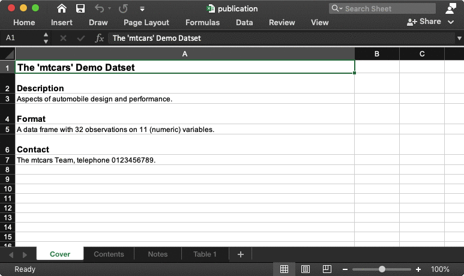

```{r, include = FALSE}
knitr::opts_chunk$set(
  collapse = TRUE,
  comment = "#"
)
```

## Purpose

This vignette demonstrates how to use {a11ytables} to generate a spreadsheet output that automatically follows [best practice](https://analysisfunction.civilservice.gov.uk/policy-store/releasing-statistics-in-spreadsheets/).

## Installation

Install the package [from GitHub](https://github.com/co-analysis/a11ytables) using [{remotes}](https://remotes.r-lib.org/).

```{r install, eval=FALSE}
install.packages("remotes")  # if not already installed
remotes::install_github("co-analysis/a11ytables")
```

The package depends on [{openxlsx}](https://ycphs.github.io/openxlsx/) and [{pillar}](https://pillar.r-lib.org/), which are also installed with {a11ytables}.

## Workflow

Having installed the {a11ytables} package, there are three steps to generating a compliant spreadsheet:

1. Use `create_a11ytable()` to create a special dataframe (with class 'a11ytable') that contains all the content that will go in your spreadsheet
1. Pass the output to `generate_workbook()` to convert the a11ytable to {openxlsx}'s 'Workbook' class, which adds spreadsheet structure and styles
1. Pass the output to `openxlsx::saveWorkbook()` to write out to an xlsx file (or `openxlsx::openXL()` to open a temporary copy)

The minimal demo below follows these steps using the example data from [the classic mtcars dataset](https://rdrr.io/r/datasets/mtcars.html).

You can use the package's [RStudio Addin](https://rstudio.github.io/rstudioaddins/), which is installed with {a11ytables}, to insert a pre-filled demo skeleton of this workflow (RStudio users only).

### 1. Create an a11ytable

Each argument to `create_a11ytable()` provides the information needed to construct each sheet in the spreadsheet.

| Argument | Type | Required | Accepted values | Explanation |
| :--- | :--- | :- | :--- | :------ |
| `tab_titles` | Character vector | Yes | | The name that will appear on each sheet's tab in the output spreadsheet |
| `sheet_types` | Character vector | Yes | 'contents', 'cover', 'notes', 'tables' | The kind of information that the sheet holds, which is needed so that the correct structure and formatting can be applied later |
| `sheet_titles` | Character vector | Yes | | The main heading of each sheet, which will appear in cell A1 |
| `blank_cells` | Character vector | No | | A sentence that explains the reason for any blank cells in the sheet (if applicable) |
| `sources` | Character vector | No | | A sentence provides the source of the data found in each table (if applicable, likely only needed for sheets with `sheet_types` of 'table') |
| `tables` | List of dataframes (cover can be a list) | Yes | | The main content for each sheet, expressed as flat ([probably tidy](https://www.jstatsoft.org/article/view/v059i10)) dataframes of rows and columns (though the cover can be a list) |

You can read more about these arguments and their requirements in the function's help pages, which you can access by running `?create_a11ytable`. See also the [terminology vignette](https://co-analysis.github.io/a11ytables/articles/terminology), `vignette("terminology", "a11ytables")`, for these terms and more.

#### Pre-prepare tables

Rather than pass a big list of dataframes directly to the `tables` argument of `create_a11ytable()`, it's preferable to prepare them first into their own named objects.

Below are some demo tables that we will later pass to `create_a11ytable()`. I've used `tibble::tribble()` for human-readable row-by-row dataframe construction, but you can just use `data.frame()` if you want.

Note that you can use the RStudio Addin 'Insert table templates using 'tibble'' and 'Insert table templates using 'data.frame'' to insert a demo skeleton into your R script.

##### Meta-sheets

The cover can accept either a list or a data.frane (the latter was the only acceptable input prior to version 0.2.0). We recommend a list so that you can have multiple rows per section on the cover. This also means you can dedicate certain rows to be hyperlinks to web URLs or mailto links that will open an email client. Here's a demo list for the contents page (required):

```{r tables-cover-list}
cover_list <- list( 
  "Description" = "Aspects of automobile design and performance.",
  "Properties" = "Suppressed values are replaced with the value '[c]'.",
  "Contact" = c(
    "Contact the mtcars Team.",
    "Telephone 0123456789.",
    "Email us at [invented_email@not_real.com](mailto:invented_email@not_real.com)."
  )
)
```

<details><summary>Click for an alternative data.frame input for the cover.</summary>

Instead of a list, you could provide a data.frame that contains information for the cover sheet. The limitation with this approach is that---for each section on the cover sheet---you are restricted to one cell for the header and one cell for body content. That might not be ideal if you want to dedicate some cells within a section to be hyperlinks. 

Here's a demo data.frame for the cover that has a column for sub-headings and a column for the content of each one:

```{r tables-cover-df, eval=FALSE}
cover_df <- tibble::tribble( 
  ~"subsection_title",  ~"subsection_content",
  "Description", "Aspects of automobile design and performance.",
  "Properties",  "Suppressed values are replaced with the value '[c]'.",
  "Contact",     "The mtcars Team, telephone 0123456789."
)
```

</details>

Here's a demo table for the contents page (required):

```{r tables-contents}
contents_df <- tibble::tribble(
  ~"Sheet name", ~"Sheet title",
  "Notes",       "Notes used in this workbook",
  "Table 1",     "Car Road Tests (demo)"
)
```

And here's a demo table for the notes page (not required if there's no notes in your tables), which has a column for the note number in the form '[note x]' and and column for the note itself:

```{r tables-notes}
notes_df <- tibble::tribble(
  ~"Note number", ~"Note text",
  "[note 1]",     "US gallons.",
  "[note 2]",     "Retained to enable comparisons with previous analyses."
)
```

<details><summary>Click to preview these tables</summary>
```{r tables-meta-expand}
cover_list
contents_df
notes_df
```
</details>

##### Statistical tables

This code generates a demo dataframe that we're going to pretend is the statistical data that we want to publish:

```{r}
stats_df <- mtcars |>
  head() |>
  tibble::rownames_to_column("car") |>
  subset(select = c("car", "cyl", "mpg"))

names(stats_df) <- c(
  "Car",
  "Cylinder count",
  "Miles per gallon [note 1]"  # notes go in headers, not cells
)

stats_df$Notes <- c(  # add 'Notes' column
  rep("[note 2]", 2), 
  rep(NA_character_, 4)
)

stats_df[3, 2:3] <- "[c]"  # suppressed (confidential) data
```

<details><summary>Click to preview this table</summary>
```{r table-stat-expand}
stats_df
```
</details>

See [the best practice guidance](https://analysisfunction.civilservice.gov.uk/policy-store/releasing-statistics-in-spreadsheets/) for more information on how to present data in these tables.

#### Create a11ytable

Now we can construct an a11ytable by passing the required sheet elements as character vectors with `c()`, or a `list()` in the case of the `tables` argument, to the `create_a11ytable()` function. You can use `NA_character_` wherever an element isn't required.

Note that you can use the RStudio Addin 'Insert 'a11ytable' Template' to insert a demo skeleton into your R script.

```{r new-a11ytable}
my_a11ytable <- 
  a11ytables::create_a11ytable(
    tab_titles = c(
      "Cover",
      "Contents",
      "Notes",
      "Table 1"
    ),
    sheet_types = c(
      "cover",
      "contents",
      "notes",
      "tables"
    ),
    sheet_titles = c(
      "The 'mtcars' Demo Datset",
      "Table of contents",
      "Notes",
      "Table 1: Car Road Tests"
    ),
    blank_cells = c(
      NA_character_,
      NA_character_,
      NA_character_, 
      "Blank cells indicate that there's no note in that row"
    ),
    sources = c(
      NA_character_,
      NA_character_,
      NA_character_, 
      "Motor Trend (1974)"
    ),
    tables = list(
      cover_list,
      contents_df,
      notes_df,
      stats_df
    )
  )
```

The function will return errors or warnings if anything is missing or seems odd. For example, we were warned that a value we supplied to `tab_title` had to be cleaned from 'Table 1' to 'Table_1', since blank spaces are not allowed.

Here's a preview of the object that was created:

```{r a11ytable-preview}
my_a11ytable
```

You can immediately tell that this is an a11ytable because it's the first word that's printed with the output.

So our a11ytable is basically just a table with one row per sheet and one column per sheet element. In fact, it has class 'data.frame'/'tbl' along with 'a11ytable'. For convenience, you can also check for the a11ytable class with `is_a11ytable()`.

Note that `create_a11ytable()` is the preferred method for generating a11ytable-class objects, but it's also possible to convert a correctly-formatted, pre-built data.frame or tibble directly to an a11ytable with `as_a11ytable()`. You can try this using the `mtcars_df` data.frame that's provided with {a11ytables}, which is a specially-prepared subset of [the mtcars dataset](https://rdrr.io/r/datasets/mtcars.html).

### 2. Convert to a workbook

We can use `generate_workbook()` to convert our a11ytable to an [{openxlsx}](https://ycphs.github.io/openxlsx/) Workbook-class object.

This type of object adds information from each row of our a11ytable into separate sheets and applies other relevant structure, mark-up and styles for compliance with [the best practice guidance](https://analysisfunction.civilservice.gov.uk/policy-store/releasing-statistics-in-spreadsheets/).

```{r create-a11y-wb}
my_wb <- a11ytables::generate_workbook(my_a11ytable)
```

<details><summary>Click for a preview of the Workbook object</summary>

The print method for a Workbook-class object is fairly limited, but you can see an overview of our named sheets and some of the custom styling.

```{r wb-preview}
my_wb
```
</details>

### 3. Write to file

Finally, you can use [the `saveWorkbook()` function from {openxlsx}](https://ycphs.github.io/openxlsx/reference/saveWorkbook.html) to write your workbook object to an xlsx file (set the filename argument to a location suitable for your work).

```{r saveworkbook, eval=FALSE}
openxlsx::saveWorkbook(my_wb, "publication.xlsx")
```

You could also open a temporary copy of the workbook with `openxlsx::openXL()`, which is convenient during the development process.

#### Output

The content of the output spreadsheet will look like this:

<div class="figure">

</div>

You'll notice that various best-practice formatting (e.g. Arial size 12 font for body text) and mark-up (e.g. tables, donated by a marker in the lower-right corner of the lower-right cell of each one) have been applied throughout.

Note also that two 'pre-table' meta-elements were created automatically in the sheets that contain statistical tables, which you didn't need to supply to `create_a11ytable()`: (1) the number of tables and (2) the presence of notes.

#### Final tweaks

It's your responsibility to check and amend the output from {a11ytables} to ensure it meets user's accessibility needs.

You can apply some final tweaks to the output xlsx file if the defaults don't quite meet your requirements (e.g. some column widths), though it's advisable to keep changes to a minimum for reproducibility purposes and because you may undo some of the compliant structuring and formatting that {a11ytables} provides.

At time of writing (v0.2.0) you might want to address manually some other [accessibility requirements](https://analysisfunction.civilservice.gov.uk/policy-store/releasing-statistics-in-spreadsheets/) that are not yet covered by the package:

1. Fill in the document properties, which you are likely to find under 'File' then 'Properties' in your spreadsheet software
2. Convert text to hyperlinks, where required
3. Convert to an ODS file rather than the proprietary xlsx format
4. Various number-formatting issues, like padding decimal places with zeroes

Please [see the issues on GitHub](https://github.com/co-analysis/a11ytables/issues); we're trying to address a number of these limitations.

# Contribute

To contribute, please add [an issue](https://github.com/co-analysis/a11ytables/issues) or [a pull request](https://github.com/co-analysis/a11ytables/pulls) after reading [the code of conduct](https://github.com/co-analysis/a11ytables/blob/main/CODE_OF_CONDUCT.md) and [contributing](https://github.com/co-analysis/a11ytables/blob/main/.github/CONTRIBUTING.md) guidance. 
